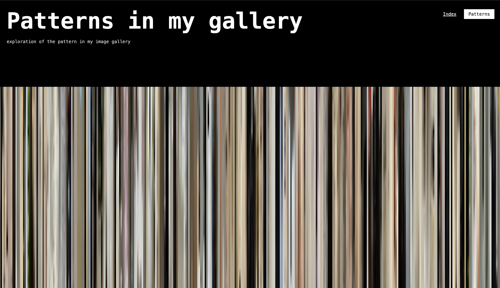
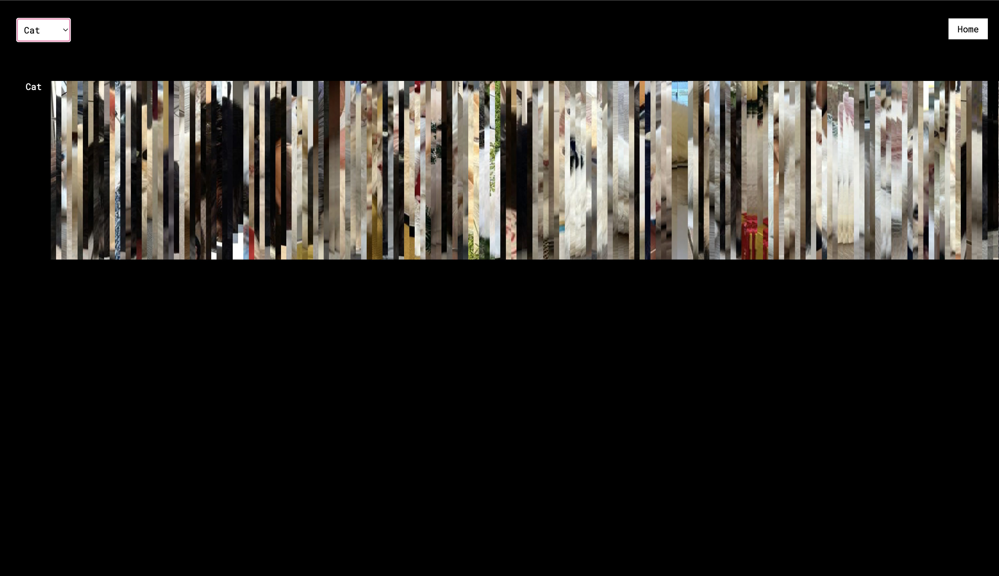

SUPSI 2023-24  
Corso d’interaction design, CV428.01  
Docenti: A. Gysin, G. Profeta  

Elaborato 2: Intermedio algoritmi

#Patterns in my gallery*
Autore: Arianna Chiodo
 
[Patterns in my gallery demo](https://ariannachiodo.github.io/gallerypattern/home.html)


## Introduzione e tema
"Patterns in my gallery" è un progetto che esplora le trame emergenti nella mia galleria di immagini, ottenute attraverso la segmentazione degli oggetti identificati dall'intelligenza artificiale. Oltre a offrire un affascinante gioco visivo, il progetto evidenzia anche le tendenze nel fotografare soggetti particolari, mostrando un numero variabile di immagini nelle diverse categorie.


## Riferimenti progettuali
Patterns in my gallery è un progetto che si propone di esplorare le trame visive che emergono nella mia collezione di immagini, prendendo ispirazione dalle regole della Gestalt. Questi principi fondamentali dell'organizzazione percettiva guidano la presentazione e la percezione delle immagini da parte degli utenti. Attraverso l'applicazione dei principi della Gestalt, quali similitudine, continuità e prossimità, le immagini vengono raggruppate in base a caratteristiche comuni o disposizioni spaziali. 

## Design dell’interfraccia e modalià di interazione
L'interfaccia si compone di due schermate principali: nella home, troviamo un titolo, un sottotitolo, pulsanti di navigazione e un'anteprima astratta del pattern presente nella seconda schermata. La seconda schermata mostra gli oggetti identificati insieme ai rispettivi label che indicano le categorie. È presente anche un menu a tendina che consente di isolare e visualizzare gruppi specifici di immagini.

[]()
[]()
[]()


## Tecnologia usata
Il codice JavaScript illustrato crea una galleria interattiva di immagini basata su dati provenienti da un file JSON. Utilizza il framework YOLO per identificare oggetti nelle immagini e organizza dinamicamente queste immagini in categorie come gatto, cane, mucca e persona. Gli utenti possono cliccare su ciascuna immagine per ingrandirla in un modal, visualizzando il label dell'oggetto identificato. Inoltre, un menu a tendina consente di filtrare le immagini per categoria. Questo approccio offre una navigazione intuitiva e facilita l'esplorazione delle immagini secondo le categorie desiderate.

```		
 async function run() {
            const response = await fetch("./data_yolo.json");
            const data = await response.json();

            data.sort((a, b) => a.Orientation - b.Orientation);

            const categories = {
                cat: document.getElementById('cat'),
                dog: document.getElementById('dog'),
                cow: document.getElementById('cow'),
                person: document.getElementById('person'),
            };

            const createGalleryItem = (imagePath, label) => {
                const galleryItem = document.createElement('div');
                galleryItem.classList.add('gallery-item');
                galleryItem.style.backgroundImage = `url('${imagePath}')`;
                galleryItem.style.backgroundPosition = 'center';

                galleryItem.addEventListener('click', () => {
                    const modal = document.getElementById('myModal');
                    const modalImg = document.getElementById('img01');
                    modal.style.display = "block";
                    modalImg.src = imagePath;
                    document.getElementById('caption').innerHTML = label;
                });

                return galleryItem;
            };

            data.forEach(item => {
                item.Objects.forEach((obj, idx) => {
                    const imagePath = `./yolo_crop/${item.FileName}_${idx}.jpg`;
                    const galleryItem = createGalleryItem(imagePath, obj.label);
                    if (categories[obj.label]) {
                        categories[obj.label].appendChild(galleryItem);
                    }
                });
            });

            const span = document.querySelector(".close");
            span.onclick = () => {
                document.getElementById('myModal').style.display = "none";
            };

            document.getElementById('category-select').addEventListener('change', (event) => {
                const selectedCategory = event.target.value;
                if (selectedCategory === 'all') {
                    Object.values(categories).forEach(category => {
                        category.style.display = 'flex';
                    });
                } else {
                    Object.values(categories).forEach(category => {
                        category.style.display = 'none';
                    });
                    categories[selectedCategory].style.display = 'flex';
                }
            });

            // Show all categories initially
            Object.values(categories).forEach(category => {
                category.style.display = 'flex';
            });
        }

        window.addEventListener("load", run);
```

## Target e contesto d’uso
Il progetto "Patterns in my gallery" potrebbe essere inserito in una mostra interattiva che utilizza l'intelligenza artificiale per esplorare e categorizzare le tendenze fotografiche presenti nelle immagini. Questa esposizione educativa e espositiva illustra come l'IA possa riconoscere e organizzare diversi tipi di oggetti nelle fotografie, offrendo un'opportunità per i visitatori di comprendere le diversità culturali e visive rappresentate attraverso la fotografia.


